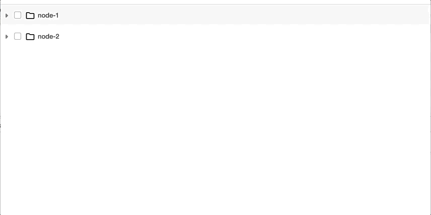

This is just an example of how to use "react-virtualised-tree" component in your code.

```
<div className="my-tree-container">
    <Tree
        noCascade={false}
        checkable={true}
        nodes={nodes}
        expandDisabled={false}
        checked={chcked}
        expanded={expanded}
        loading={loading}
        onCheck={this.onCheck}
        onExpand={this.onExpand}
        optimisticToggle={true}
    />
</div>
```

- checked, expanded, loading are array of node values which are checked, expanded, loading respectievely.
- onCheck and onExpand are functions which will be called on corresponding actions.
- Here is a working demo :-

